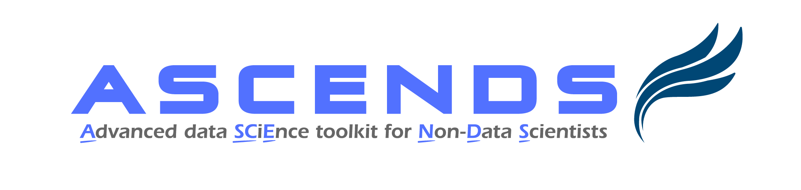
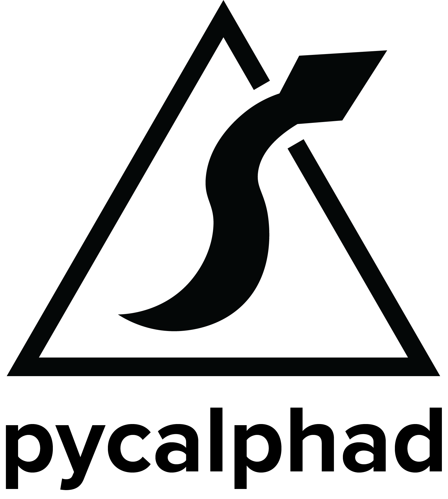
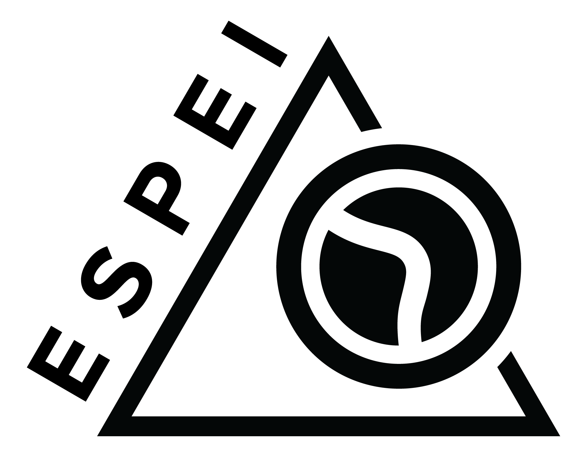

# Software Tools from Machine Learning to Phase Diagrams (July 13 and 14, 2022)

## Organizers

Richard Otis (Materials Genome Foundation) 
Dongwon Shin (Oak Ridge National Laboratory) 
Brandon Bocklund (Lawrence Livermore National Laboratory) 
Zi-Kui Liu (Pennsylvania State University) 

*Where:* Virtual (Zoom) 
*When:* 11 am - 2 pm EST (5 - 8 pm CET / 8 - 11 am PST) on July 13 and 14, 2022 
*Registration deadline:* **July 8, 2022** 

## Overview
CALPHAD (Calculation of Phase Diagrams) is one of the most powerful techniques for Materials Genome and Integrated Computational Materials Engineering (ICME) modeling. While originally based on experimental measurements and extrapolation, the CALPHAD approach has been extended to also include results of atomistic simulation for phases and states which are not experimentally accessible. With the introduction of modern workflow management tools in the atomistic community, it is now possible to use atomistic simulations to facilitate rapid CALPHAD database development. More recently, methods and user tools have been developed that enable automated, reproducible CALPHAD parameter evaluation and uncertainty quantification.

This workshop will give a detailed introduction to computational thermodynamic software based on the CALPHAD method  – pycalphad and ESPEI - as well as an introduction to machine learning methods in computational materials science using the ASCENDS software. It will feature hands-on demonstrations in an interactive cloud environment and practical exercises that will enable attendees to perform machine learning calculations, develop CALPHAD databases with quantified uncertainty, and to propagate uncertainty to any thermodynamic calculation.
 
### [ASCENDS](https://github.com/ornlpmcp/ASCENDS)

The Advanced data SCiEnce toolkit for Non-Data scientists (ASCENDS) is an open-source toolkit to assist scientists/engineers who want to apply modern data analytics to their own tabular data _without_ any programming from their local machines. It provides a streamlined, intuitive interface to analyze correlation, train machine learning models, and make predictions from surrogate digital twins within minutes.

 
### [pycalphad](https://pycalphad.org)
pycalphad is a free and open-source Python library for calculating phase diagrams, designing thermodynamic models, and investigating phase equilibria within the CALPHAD method.

It provides routines for reading thermodynamic databases and solving the multi-component, multi-phase Gibbs energy minimization problem.
All Gibbs energy and property models in pycalphad are described symbolically allowing the models to be customized or overridden by users at runtime without changing any of the pycalphad source code. Calculation results from pycalphad are returned as multidimensional xarray datasets that make it easy to incorporate pycalphad into any tool or workflow.
 
### [ESPEI](https://espei.org)
The Extensible Self-optimizing Phase Equilibria Infrastructure (ESPEI) package is a tool for thermodynamic database development and uncertainty quantification within the CALPHAD method.

It uses pycalphad for the forward calculation of thermodynamic properties to solve the inverse of parameter evaluation problem. ESPEI uses a two step method to first parameterize thermodynamic models and then optimize and determine the uncertainty of the parameters using Markov Chain Monte Carlo (MCMC).

## How to register
Interested graduate students, postdoctoral or early-career researchers, and other enthusiasts are encouraged to register prior to the deadline on **July 8, 2022**.

Please be sure to use a valid e-mail address with payment, as this is how the organizers will communicate with you regarding workshop logistics.

      

        

          <select id="item-options" size="2"><option value="MGF Virtual Workshop Registration - July 13 and 14, 2022 - Standard Attendee" price="199">Standard Attendee - 199 USD</option><option value="MGF Virtual Workshop Registration - July 13 and 14, 2022 - Student Attendee" price="29">Student Attendee - 29 USD</option></select>
          <select style="visibility: hidden" id="quantitySelect"></select>
        

      

      

## Agenda
All times are in Eastern Standard Time.
### Day 1 (July 13, 2022)
- 11:00am Opening
- 11:05 Introduction to data science for materials research
- 11:35 ASCENDS overview
- 12:05pm Break
- 12:15 ASCENDS demonstration
- 12:45 Interactive: Case Studies and Examples
- 1:30 Q&A and closing
 
### Day 2 (July 14, 2022)
- 11:00am Opening
- 11:05 Introduction to pycalphad
- 11:15 Interactive: Calculating thermodynamic properties with pycalphad
- 11:45 Introduction to ESPEI
- 12:00pm Interactive: ESPEI for CALPHAD database assessment and uncertainty quantification
- 12:30 Break
- 12:40 Interactive: Uncertainty propagation with PDUQ
- 1:10 Day 2 Summary and Discussion
- 1:55 Closing
